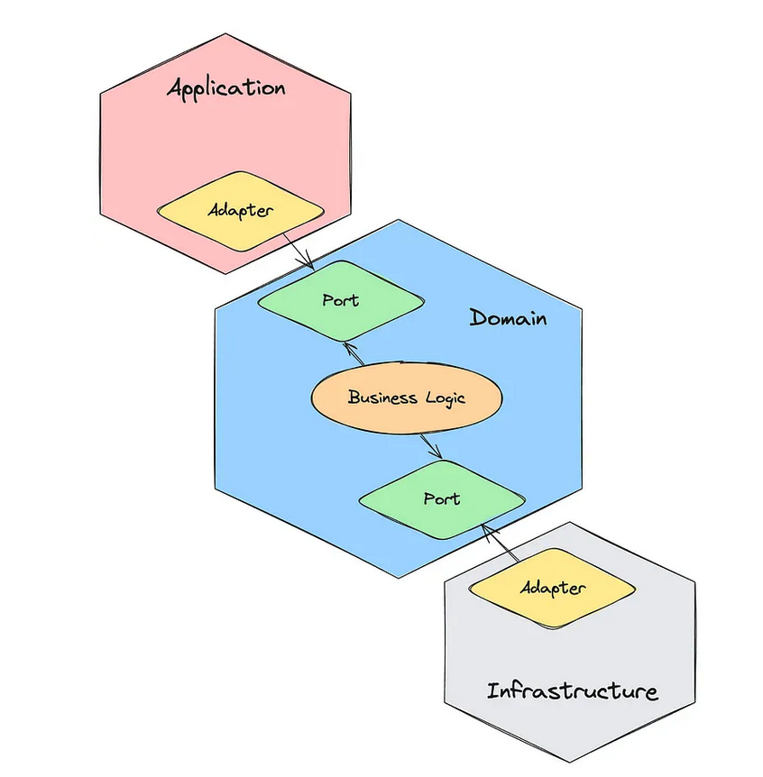

# Hexagon Architecture

According to Wikipedia, The `hexagonal architecture`, or `ports and adapters architecture`, is an architectural pattern used in software design. It aims at creating loosely coupled application components that can be easily connected to their software environment by means of ports and adapters. This makes components exchangeable at any level and facilitates test automation.

This was invented by Alistair Cockburn in an attempt to avoid known pitfalls such as dependencies between layers and contamination of user interface code with the business logic.

## Components

The Hexagonal architecture divides a system into several loosly-coupled interchangable `components`, such as
- application core
- persistence layer
- interfaces with other systems
    - messaging system
    - external apis etc.

## Ports

Each component is connected to the others through a number of exposed `ports`. Communication through these ports follow a given protocol depending on their purpose.  

## Adapters

`Adapters` on the other hand are the glue between the components and the outside world. 
They facilitate the exchanges between the external world and the ports that represent the requirement (usecases) of the inside of the application components.  

There can be several adapters (`implementations`) for one port.  
Example :  
data can be provided or inputed by user through  
    - user interface  
    - command line interface  
    -  an automated data source  
    - test script  
    - messaging system etc.  

## Diagram

## When to use Hexagonal architecture vs N tiered architecture

| Criteria   |      N Tiered Architecture      |  Hexagonal architecture |
|----------|:-------------:|------:|
| Application Complexity | Suitable for simple, CRUD-heavy applications | Ideal for complex applications wuth intricate business rules and busiess logic |
| Data flow | Works best with predictable, linear data flow between UI, business and data layers | Suports flexible data flow, allowing various external systems to interact with the core through adapters |
| System integration | Limited external integrations; stable dependencies. | Frequent or evolving integrations with external systems (APIs, messaging, etc.). |
| Component coupling | Tightly coupled layers with direct dependencies between them. | Loosely coupled components that interact through well-defined ports and adapters. |
| Testability | Basic testing usually sufficient, but tightly coupled components may hinder isolated testing. | Highly testable; components can be tested in isolation using mock adapters. |
| Flexibility and Modularity | Lower flexibility; modifying dependencies may require changes across multiple layers. | High flexibility; swapping components (e.g., database or UI) only requires updating or adding adapters. |
| Maintenance and scalability  | Easier to maintain in small-to-medium applications; not ideal for large, evolving systems. | Scalable for large systems; changes in technology or requirements are easier to manage over time. |
| Use cases |  |  |

## Summary

- `Use N-Tiered Architecture` if the application has simple, predictable workflows, a few integrations, and tightly coupled layers that are unlikely to change.

- `Use Hexagonal Architecture` if the application requires flexibility, is highly modular, integrates with many external systems, or needs to scale and adapt over time.

---

## References

- https://en.wikipedia.org/wiki/Hexagonal_architecture_(software)
- https://itnext.io/hexagonal-architecture-fe1250fb52be 
- https://medium.com/blablacar/pragmatic-hexagonal-architecture-f0dbc70b736d
- https://softwareengineering.stackexchange.com/questions/429216/how-does-hexagonal-architecture-solve-n-tiers-service-spagetti
